# Daily Report Generator

This project is an automated Python pipeline that reads transaction data from a Google Sheet, processes key financial metrics, and generates a daily PDF report with charts.

## Features

- Load data from Google Sheets
- Filter data by selected date
- Calculate:
  - Total transactions
  - Total volume
  - Failure rate
  - Top wallets by volume
- Generate bar chart per asset
- Export results into a formatted PDF report

## Requirements

Install dependencies:

```bash
pip install -r requirements.txt
```

Install dependencies:

```bash
GOOGLE_SHEET_ID="your_google_sheet_id"
```

## How to Run

```bash
python report.py --date YYYY-MM-DD
```

Example:

```bash
python report.py --date 2026-04-28
```

## Output

After running the script, you will get:
PDF report → `daily_report_YYYY-MM-DD.pdf`

## Pipline Flow Diagram



## Functions Overview

| Function                          | Description                                                            |
| --------------------------------- | ---------------------------------------------------------------------- |
| `read_public_google_sheet()`      | Reads data from Google Sheet and filters it by date                    |
| `get_volume_per_asset()`          | Calculates total trading volume per asset                              |
| `get_failed_transactions_count()` | Counts the number of failed transactions                               |
| `get_top_wallets_by_volume()`     | Returns top wallets by total transaction volume                        |
| `calculate_summary_metrics()`     | Computes key report metrics (total volume, transactions, failure rate) |
| `create_volume_chart()`           | Generates a bar chart for asset volumes and saves it as an image       |
| `build_pdf_report()`              | Builds the final PDF report with charts and tables                     |
| `generate_report()`               | Orchestrates the full reporting pipeline (charts + PDF)                |
| `main()`                          | Entry point of the script and handles CLI arguments                    |

## Deployment Guide (Google Cloud Run + Cloud Scheduler)

This project is deployed as a serverless data pipeline using Google Cloud Run and automated using Cloud Scheduler.

---

## Cloud Run Setup

First, open Google Cloud Console and select your project.

Go to **Cloud Run** from the services menu.

Click **Create Service**.

Choose: **Existing container image**

In the configuration section:

- Add environment variables such as `GOOGLE_SHEET_ID`

Click **Deploy** and wait until the service is created.

After deployment, Cloud Run will generate a public URL.  
This URL is used to trigger the report generation pipeline.

---

## Cloud Scheduler Setup

Go to **Cloud Scheduler** in Google Cloud Console.

Click **Create Job**.

Set a job name.

Define the schedule using a cron expression:

0 9 \* \* \*

(This runs the job every day at 9 AM)

Click **Create** to activate the scheduler.

---

## Report Output Location

The generated report is created and stored inside the **Cloud Run container** during execution.

Since Cloud Run is stateless, all generated files exist only within the container runtime and are not permanently stored.

---

## Note

As an enhancement, the generated report can also be automatically sent via email after creation using an email service such as SMTP or SendGrid.
